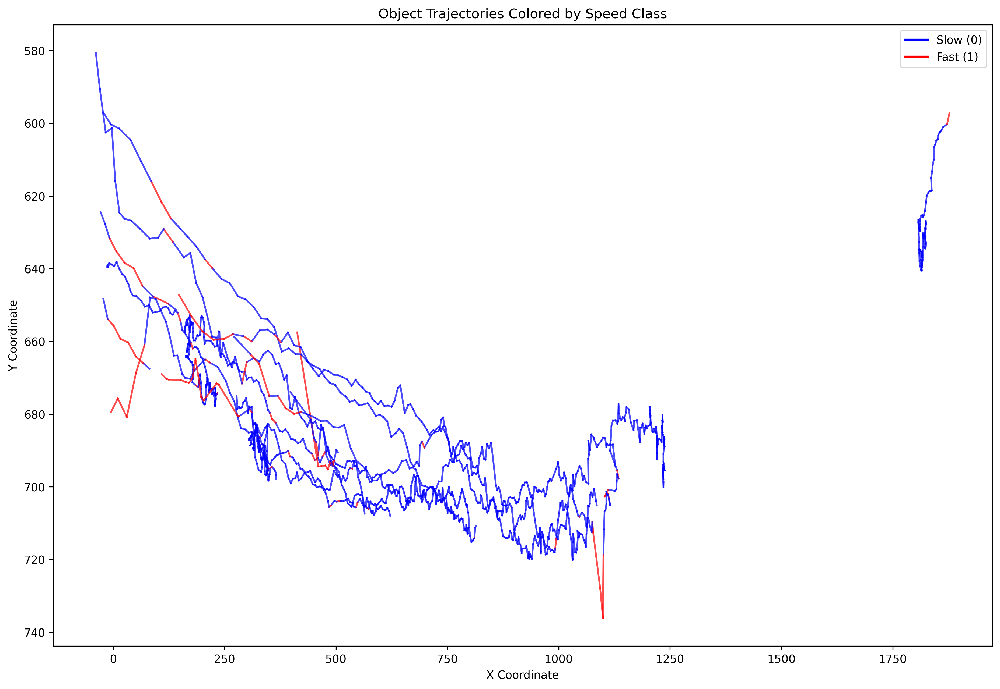

# Speed Statistics Analysis

## Image Acquisition

```bash
python VCD/fast_vision/mot_speed_analysis.py <path_to_your_MOT_tracking_results_txt> -o <output_folder>
```

All images in this `/plot` folder are visualizations derived from the data obtained by YOLOX+Bytetrack inference on the video video_0006.mp4 from the JAAD dataset. The specific inference command is:

```bash
python VCD/fast_vision/mot_speed_analysis.py <where_you_save_MOT_results>/video_0006_person.txt -o VCD/fast_vision/plots
```

## Image Analysis


- This image shows the specific data of speed prediction labels in the video, providing a macro view of the overall pedestrian movement speed in the video.


- This is a boxplot of the relative pixel motion speed of objects with different speed labels. It can be seen that the speed labels we assigned are able to classify the relative motion speed of objects with reasonable accuracy.


- These images display the variation trend of the speed prediction labels and the relative motion pixel size of the bounding boxes over time. It can be observed that the predicted speed labels are generally consistent with the motion speed of the identified bounding boxes.




- These images visualize the motion trajectories/spatial distribution of objects with different speeds, where red represents fast objects and blue lines represent slow objects. It can be observed that objects move slower when they are in the center of the screen and faster when they are about to leave the screen, which aligns with intuition.


- This image shows the changes in the speed labels. It can be seen that the labels for slower objects are more stable, while the labels for faster objects tend to undergo more abrupt changes, indicating less stability in recognition.

