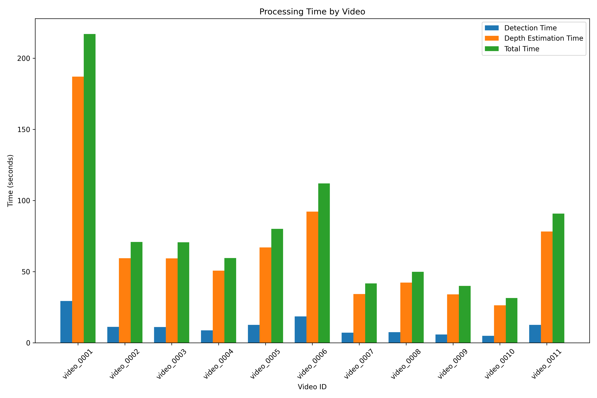

## Slow Vision: GroundingDINO Speed Analysis & DPT analysis on JAAD

### Setup

1. Install dependencies:
   ```bash
   # Fetch submodules
   git submodule update --remote VCD/slow_vision/GroundingDINO
   cd VCD/slow_vision/GroundingDINO
   pip install -e .
   cd ../../..

   git submodule update --remote VCD/slow_vision/segment-anything
   cd VCD/slow_vision/segment-anything
   pip install -e .
   cd ../../..

   git submodule update --remote VCD/slow_vision/DPT
   cd VCD/slow_vision/DPT
   pip install -e .
   cd ../../..
   ```

2. Download pre-trained weights:
   ```bash
   mkdir -p config/weights
   cd config/weights

   # Download GroundingDINO weights
   wget https://github.com/IDEA-Research/GroundingDINO/releases/download/v0.1.0-alpha/groundingdino_swint_ogc.pth

   # Download sgement-anything weights
   wget https://dl.fbaipublicfiles.com/segment_anything/sam_vit_h_4b8939.pth

   # Download DPT weights
   wget https://github.com/intel-isl/DPT/releases/download/1_0/dpt_large-midas-2f21e586.pt

   cd ../..
   ```

### Usage Guide

1. GroundingDINO speed analysis
   
   Script `VCD/slow_vision/groundingdino_speed_analysis.py` is used for speed analysis on JAAD dataset. Run this script with the following command:

   ```bash
   python VCD/slow_vision/groundingdino_speed_analysis.py <your_path_to_JAAD_dataset>/images --text_prompt person
   ```

2. DPT analysis
   
   Script `VCD/slow_vision/DPT_analysis.py` is used for DPT analysis on JAAD dataset. Run this script with the following command:

   ```bash
   python VCD/slow_vision/DPT_analysis.py <your_path_to_JAAD_dataset>/images <output_dir>
   ```

   All result CSV files will be saved in the specified `<output_dir>`. Each line in the CSV files follows this format: `Frame_id, Person_id, x1, y1, x2, y2, Average Depth, Angle, Distance Level, cneter_X, center_Y, catagory`。

   - `Frame_id`: Index of the video frame.
   - `Person_id`: Identifier for the detected person, based on the object detection output.
   - `x1, y1, x2, y2`: Coordinates of the person's bounding box.
   - `Average Depth`: Estimated distance from the person to the camera.
   - `Angle`: Relative angle between the person and the camera.
   - `Distance Level`: Level 1 (0-5m): High Alert Area. Level 2 (5-10m): Alert Area. Level 3 (10-15m): Caution Area. Level 4 (>15m): Far.
   - `cneter_X, center_Y`: Coordinates of the bounding box center.
   - `catagory`: We divide each video frame into six regions (2 rows × 3 columns), indexed from 0 to 5 in row-major order (top-left to bottom-right). `category` indicates the index of the region that the person occupies.

### Result

1. GroundingDINO speed analysis
   | Model           | Speed on RTX3090 (FPS)    |
   | -------------- | ----------------------------- |
   | GroundingDINO | 8.69 |

   It can be concluded that GroundingDINO is capable of achieving real-time inference on commercial GPUs.

2. DPT analysis
   
   | Task           | speed on RTX3090 (sec per frame)    |
   | -------------- | ----------------------------- |
   | SAM object detection | 0.85 |
   | DPT depth estimation | 3.74 |

   This indicates that DPT is over 4 times slower than SAM in terms of per-frame processing speed. The substantial computational cost of DPT is likely due to its dense prediction nature, where a full-resolution depth map is generated for each frame. For real-time or near real-time video applications, DPT may require further optimization strategies.

   The following graph provides a clear illustration of the inference speed. To maintain clarity, only a subset of videos is shown.

   